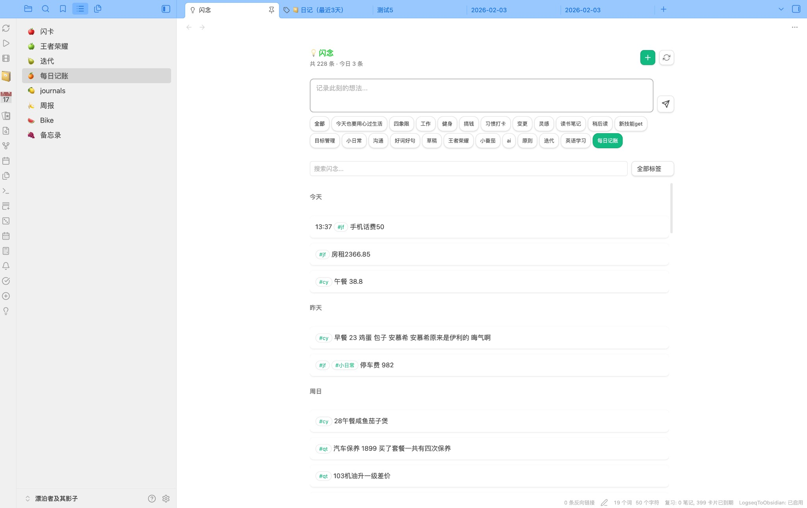
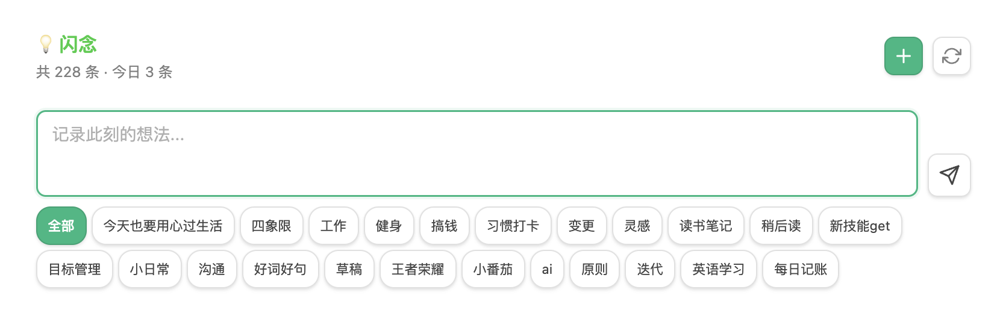
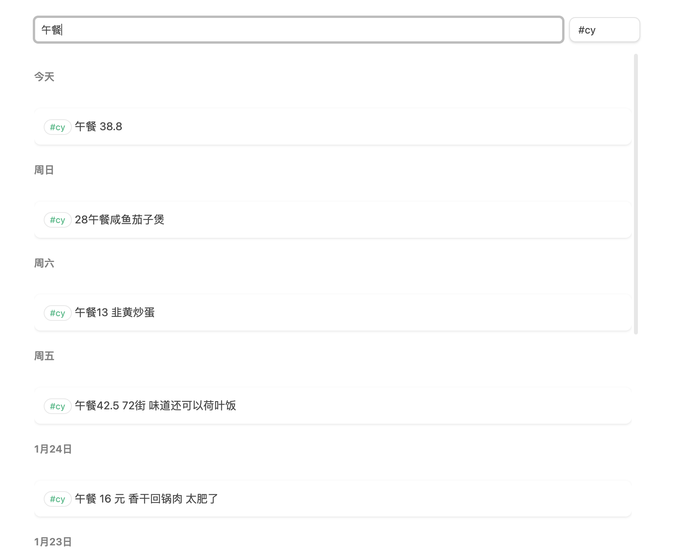
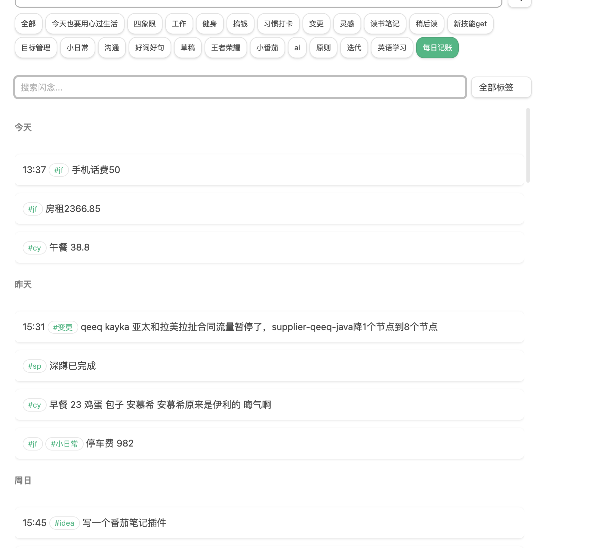
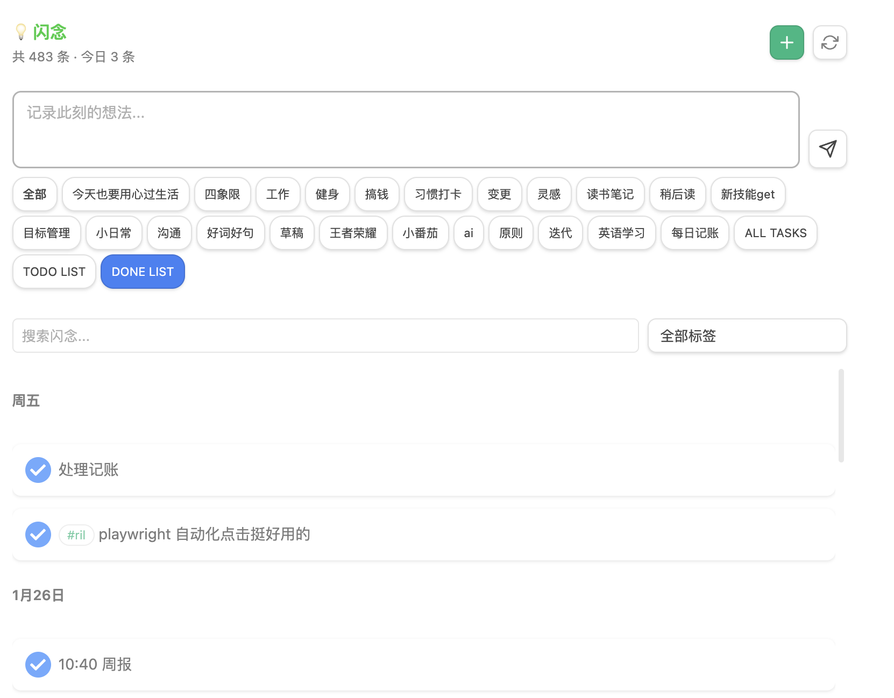
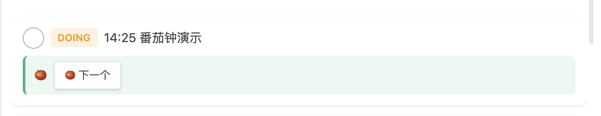
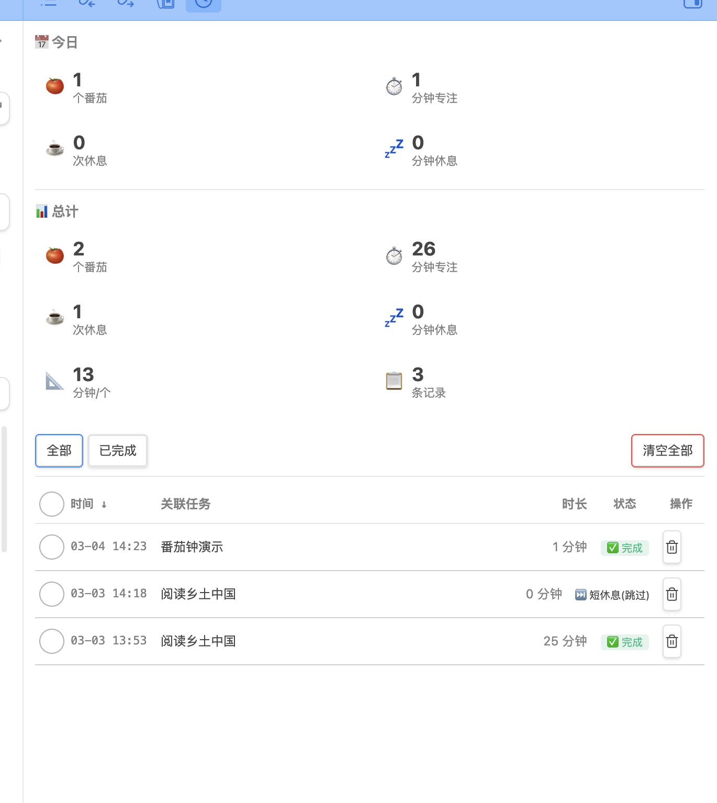
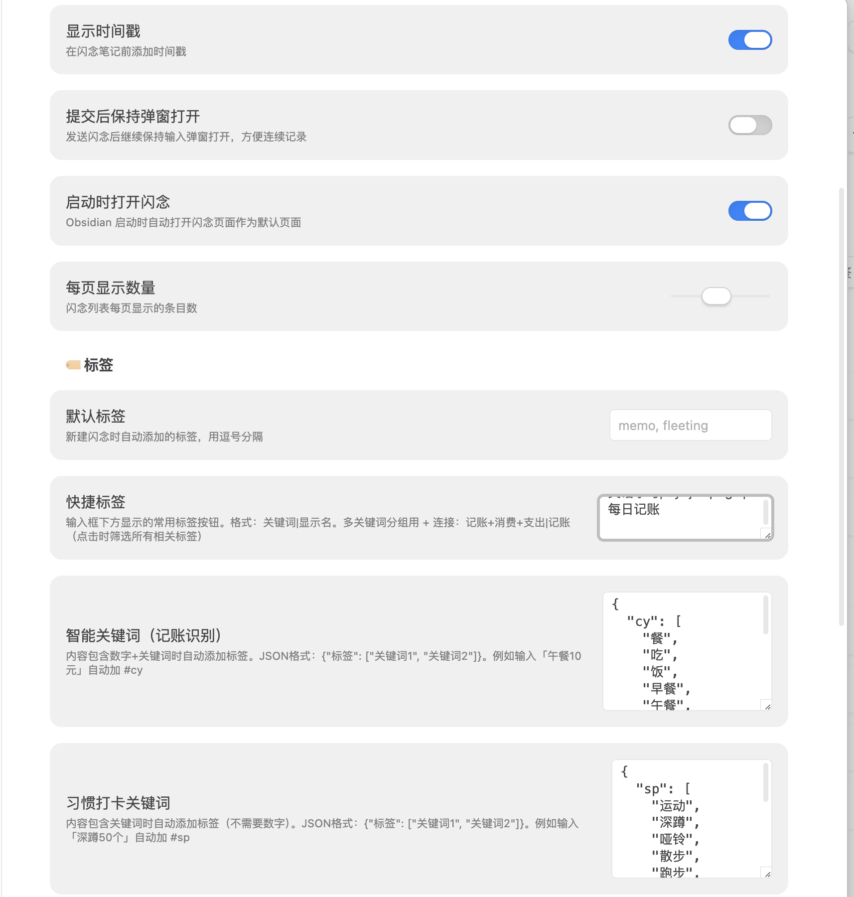

# 闪念笔记

**像发微博一样记录灵感**

[](https://github.com/fengshuzi/obsidian-memos/releases)
[](https://opensource.org/licenses/MIT)

一个轻量级的 Obsidian 灵感捕获插件，受 [Flomo](https://flomoapp.com/) 启发，与 [Logseq](https://logseq.com/) 日记格式兼容。

用最短路径把脑中的想法写下来，再通过标签和任务管理让它们产生价值。

---



## 为什么选择闪念笔记？

灵感稍纵即逝。你需要的不是一个复杂的笔记系统，而是一个**零摩擦**的记录入口：

- **一个快捷键** `Cmd/Ctrl + Shift + M` → 输入 → 回车，灵感已落纸面
- **自动时间戳**，无需手动标注时间
- **标签分类 + 智能关键词**，写「午餐13 韭黄炒蛋」自动带上 `#cy`
- **任务管理一体化**，灵感可以直接变成待办，追踪耗时，番茄钟专注
- **Journal 格式存储**，数据写在 markdown 文件里，永远是你的

## 核心功能

### 快速捕获

按下快捷键，弹出输入框，写完即走。



- `Cmd/Ctrl + Enter` 发送
- `Cmd/Ctrl + Shift + Enter` 发送并继续输入（连续记录模式）
- 支持 `#tag` 标签、`**加粗**` 等 Markdown 语法

### 标签筛选与聚合

按标签浏览、搜索关键词、用快捷标签按钮一键切换视图。





**聚合标签**：`cy+jf+qt+gw|每日记账` 表示点击「每日记账」按钮时，显示带 `#cy`、`#jf`、`#qt`、`#gw` 中任意一个标签的闪念。一条记录既是闪念，也是记账流水。

### 智能关键词

配置 `{"cy": ["午餐","早餐","咖啡"]}` 后，输入「午餐13 韭黄炒蛋」会自动加上 `#cy` 标签。无需手动打标签。

### 任务管理

灵感可以直接变成任务。支持复选框和关键词两种格式：

```markdown
- [ ] 13:33 完成项目报告
- TODO 15:00 撰写周报
- DOING 15:30 代码审查
- [x] 14:00 回复邮件
```

点击复选框即可切换状态，自动追踪耗时：

```
[ ] → DOING → [x]（带时长）
```



三个特殊标签快速筛选：
- **ALL TASKS** — 所有任务
- **TODO LIST** — 未完成任务
- **DONE LIST** — 已完成任务

### 番茄钟

内置番茄工作法，与任务深度绑定。任务进入 DOING 状态时自动启动计时。



- 专注/短休息/长休息自动轮转
- 暂停、跳过、停止随时可控
- 统计面板查看今日/累计数据



### 外部写入自动刷新

Alfred、Python 脚本、Quick Add 等外部工具修改 Journal 文件后，视图自动刷新，无需手动操作。

## 闪念格式

闪念以列表项形式存储在 Journal 文件中（如 `journals/2026-01-30.md`）：

```markdown
- 14:30 这是一条闪念
- 14:35 #想法 #灵感 记录一个点子
- 15:00 #jf 房租2366.85 闪念笔记 每日记账
- [ ] 16:00 需要完成的任务
- [x] 16:30 已经完成的任务 30分钟
```

## 安装

### Obsidian 社区市场（推荐）

上架审核中，届时可直接在 Obsidian 设置 → 第三方插件 → 社区插件中搜索「闪念笔记」安装。

### 手动安装

1. 前往 [Releases](https://github.com/fengshuzi/obsidian-memos/releases) 下载最新版本
2. 下载 `main.js`、`manifest.json`、`styles.css`
3. 在 vault 中创建 `.obsidian/plugins/obsidian-memos/` 目录
4. 将文件放入该目录
5. 重启 Obsidian，在设置 → 第三方插件中启用

## 快速开始

1. 安装并启用插件
2. 配置 Journal 文件夹路径（默认 `journals`）
3. `Cmd/Ctrl + Shift + M` 打开输入框，开始记录

## 设置选项

| 设置项 | 说明 | 默认值 |
|--------|------|--------|
| Journal 文件夹 | 闪念存储目录 | `journals` |
| 日期格式 | 文件名日期 | `YYYY-MM-DD` |
| 时间格式 | 时间戳格式 | `HH:mm` |
| 快捷标签 | 按钮与聚合标签 | — |
| 智能关键词 | 数字+关键词 → 自动标签 | — |
| 习惯打卡关键词 | 关键词 → 自动标签 | — |
| 每页显示数量 | 列表分页条数 | — |
| 提交后保持弹窗打开 | 连续记录模式 | 关闭 |
| 启动时打开闪念 | 自动打开视图 | 关闭 |
| 启用任务时间追踪 | 点击任务切换状态并追踪耗时 | 开启 |
| 自动追加时长 | 完成时显示耗时 | 开启 |
| 启用任务列表标签 | ALL/TODO/DONE 标签 | 开启 |
| 启用番茄钟 | 番茄工作法 | 开启 |
| 专注时长 | 每个番茄时长 | 25 分钟 |
| 短休息时长 | 番茄后休息 | 5 分钟 |
| 长休息时长 | 多番茄后休息 | 15 分钟 |
| 长休息间隔 | 每几个番茄长休息 | 4 个 |
| 完成提示音 | 番茄/休息完成提示 | 开启 |



## 常见问题

**Q: 闪念存在哪里？**
A: 存在「Journal 文件夹」下按日期命名的 md 文件中，如 `journals/2026-01-30.md`。数据始终在你的 vault 里。

**Q: 支持哪些任务格式？**
A: Markdown 复选框（`- [ ]`、`- [x]`）和关键词（TODO、DOING、DONE、NOW、LATER、WAITING、CANCELLED）。

**Q: 复选框点击没反应？**
A: 检查「启用任务时间追踪」是否开启。关闭后复选框为只读。

**Q: 如何查看所有待办？**
A: 点击快捷标签区域的「TODO LIST」。

**Q: 番茄钟数据存在哪？**
A: 存在 Obsidian 的 `data.json` 中，不在 markdown 文件里，不影响笔记内容。

**Q: 重启 Obsidian 后番茄钟还在吗？**
A: 运行中的番茄钟会变为暂停状态，手动继续即可。

## 设计灵感

- [Flomo](https://flomoapp.com/) — 卡片式 UI 和轻量记录理念
- [Logseq](https://logseq.com/) — Journal 格式
- [Obsidian Thino](https://github.com/Quorafind/Obsidian-Thino) — 交互参考

## 开发

```bash
npm install
npm run dev      # 开发模式
npm run build    # 构建
npm run release  # 发布到 GitHub
```

## 许可证

[MIT License](./LICENSE)
